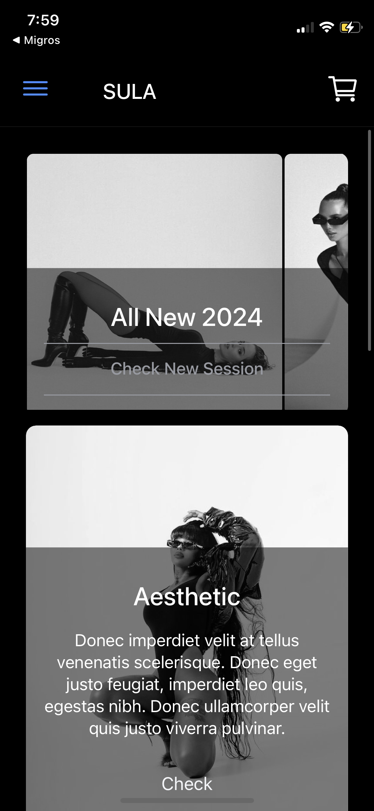
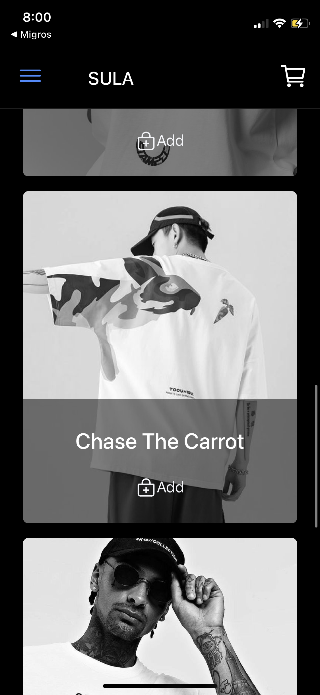
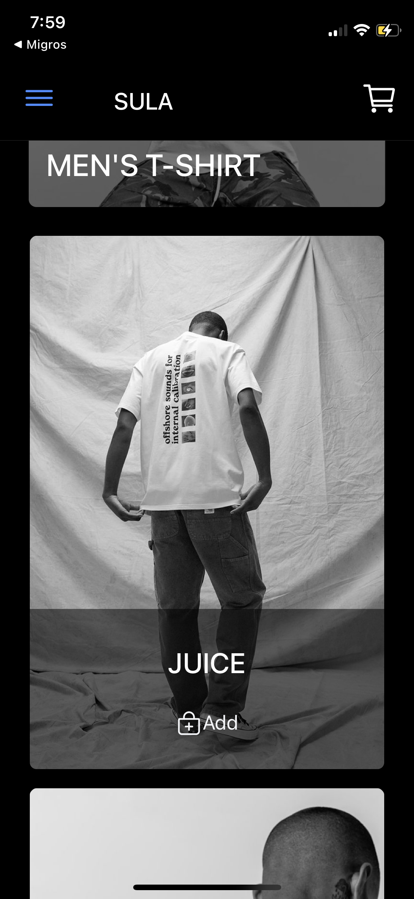
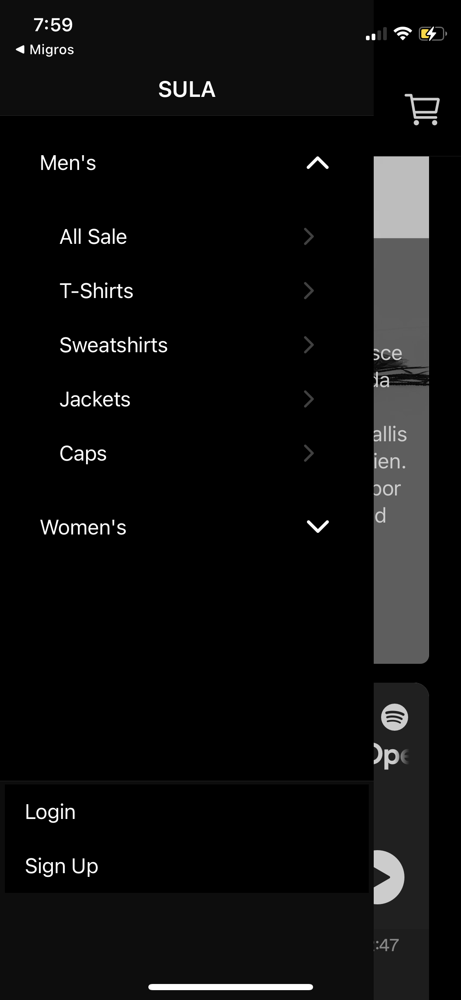

# Clothing Online Shop with Ionic & Angular

## **About The Project**

This is a simple template project for multi platform app. The project does not include backend so you need to implement your own backend logic. In order to run the project please follow the **Installation** instructions. 

## **Installation**

Before you can run this project, make sure you have the following software installed on your computer:

1. **Node.js and npm:**

   - Download and install Node.js and npm from the official website: [https://nodejs.org/](https://nodejs.org/).

2. **Angular CLI:**

   - The Angular CLI is required for building and running the Angular part of this project.
   - Install it globally using npm with the following command:
     ```
     npm install -g @angular/cli
     ```

3. **Ionic CLI:**

   - The Ionic CLI is required for building and running the Ionic part of this project.
   - Install it globally using npm with the following command:
     ```
     npm install -g @ionic/cli
     ```

Once you have installed Node.js, npm, the Angular CLI, and the Ionic CLI, you are ready to set up and run the project.

## Getting Started

Follow these steps to get the project up and running on your local machine:

1. **Clone the Repository:**

   - Use Git to clone this repository to your local machine:
     ```
     git clone [repository-url]
     ```

2. **Navigate to the Project Directory:**

   - Change your current directory to the project's root directory:
     ```
     cd [project-directory]
     ```

3. **Install Dependencies:**

   - Run the following command to install project dependencies:
     ```
     npm install
     ```

4. **Run the Development Server:**

   - To start a development server for the Angular app, run:
     ```
     ng serve
     ```

   - To start a development server for the Ionic app, run:
     ```
     ionic serve
     ```

5. **Access the App:**

   - Open your web browser and go to `http://localhost:4200` to access the Angular app.
   - If you're running the Ionic app, it will be available at `http://localhost:8100`.

That's it! You should now be able to access and work on the project locally.

## Additional Information

For more information about the project, including available commands and project structure, refer to the project documentation or README files located in specific project directories.

If you encounter any issues during the installation or setup process, feel free to reach out for assistance.

## Screenshots and Videos









## Contributing

Will be open contribution soon. If you want to collabrate, please **contact** me. 

### License

--

### Contact

@Insgtagram mertellialti
@Linkedin Mert Ellialtı
